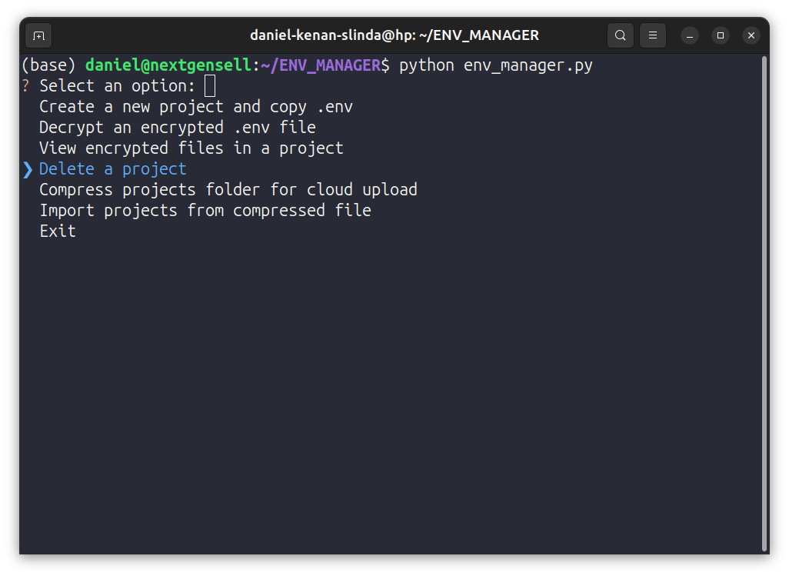

🌟 .env Manager
===============

📜 Overview
-----------

**.env Manager** is a command-line application designed to securely manage your project's environment variable files (`.env`). It allows you to create projects, copy environment files, and encrypt sensitive information, ensuring your API keys and other secrets are protected. 🚀

⚙️ Features
-----------

-   📁 **Create Projects**: Easily set up new projects and copy existing `.env` files.
-   🔒 **File Encryption**: Secure your `.env` files with password-based encryption.
-   🔑 **File Decryption**: Decrypt your `.env` files when needed.
-   💾 **Project Management**: Keep track of multiple projects and their respective `.env` files.
-   📂 **Environment File Support**: Supports multiple environment file extensions (`.env`, `.env.local`, etc.).



📦 Requirements
---------------

-   Python 3.8 or higher
-   `cryptography` library (install via `pip install cryptography`)
-   `colorama` library (install via `pip install colorama`)

🛠️ Installation
----------------

1.  **Clone the repository**:

    `git clone https://github.com/daniel-kenan/env-manager.git
    cd env-manager`

2.  **Install dependencies**:
    
    `pip install -r requirements.txt`

3.  **Run the application**:

    `python env_manager.py`

💻 Usage
--------

Upon running the application, you'll see a menu with options to create a new project, decrypt an existing encrypted file, or exit.

### Creating a New Project

1.  Choose the option to create a new project.
2.  Enter the project name and the full path to the directory containing your `.env` files.
3.  Optionally encrypt the copied files with a password.

### Decrypting an Encrypted File

1.  Choose the option to decrypt an encrypted `.env` file.
2.  Provide the path to the encrypted file and enter the password to decrypt it.

🚀 Example Interaction
----------------------

```bash
--- .env Manager ---
1. Create a new project and copy .env
2. Decrypt an encrypted .env file
3. Exit
Choose an option (1-3): 1
Enter new project name: MyProject
Enter the full path of the project (where the .env files are located): /path/to/my/project
Copying .env files from '/path/to/my/project'...
Copied '.env' to project 'MyProject'.
Do you want to encrypt the copied files? (Y/n) [Y]:
Enter a password to encrypt the copied files:
Confirm the password:
File '/projects/MyProject/.env' encrypted successfully as '/projects/MyProject/.env.encrypted'.
Do you want to delete the unencrypted files? (Y/n) [Y]:
Deleted unencrypted file '/projects/MyProject/.env'.
```

📝 License
----------

This project is licensed under the MIT License. See the LICENSE file for details.

📞 Contact
----------

For any inquiries, please reach out to Daniel Kenan Slinda.

👏 Acknowledgements
-------------------

-   Cryptography - For providing secure encryption and decryption functionalities.
-   [Colorama](https://pypi.org/project/colorama/) - For making terminal text colorful and interactive.

🤝 Contribution
---------------

We welcome contributions! If you have suggestions or improvements, please feel free to create a pull request. Your input helps make the project better for everyone. Let's communicate and collaborate in the discussions section of this repository.